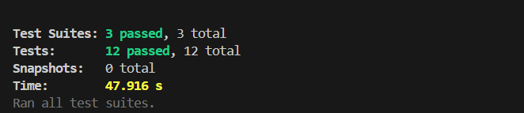
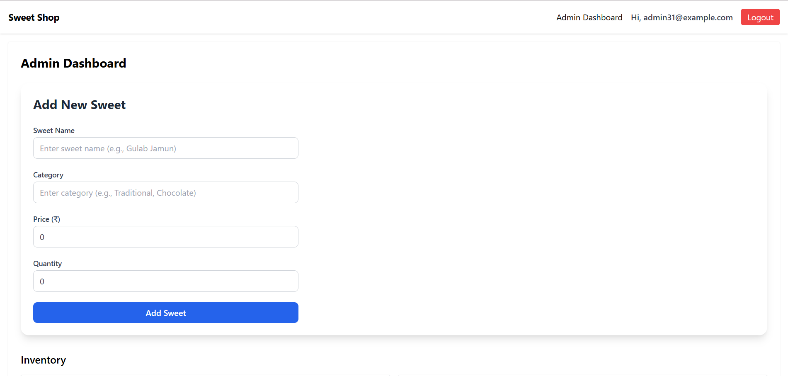
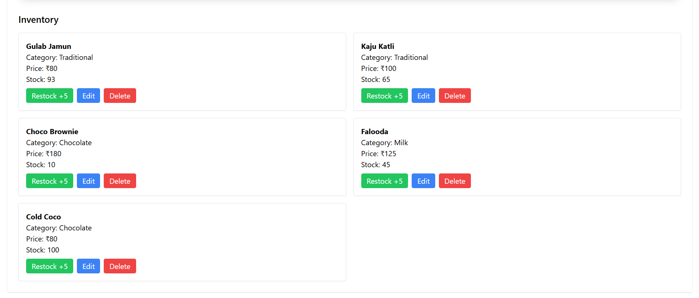
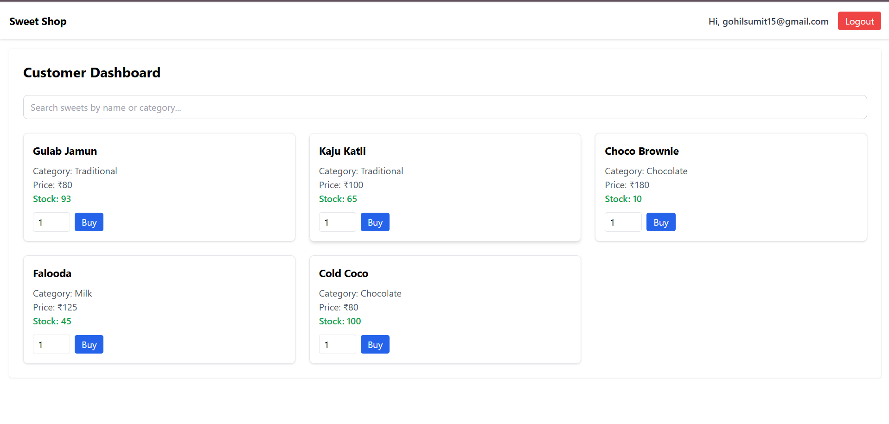
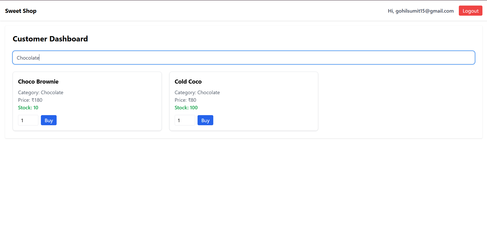

# 🍬 Sweet Shop Management System

## 📖 Project Overview
The **Sweet Shop Management System** is a full-stack web application designed to manage a sweet shop’s operations, including user authentication, sweet inventory, and role-based dashboards for customers and admins.  
This project was developed as part of the **Incubyte Assessment Kata** with a focus on **Test-Driven Development (TDD)**, clean coding, and leveraging AI responsibly.

---

## What is TDD?

**Test-Driven Development (TDD)** is a software development approach where we:

1. **Write a failing test** that defines a desired improvement or new function.
2. **Write the minimum amount of code** to pass the test.
3. **Refactor** the code while keeping tests green (passing).

🔁 **Red → Green → Refactor**

This cycle enforces:
- Simple, readable code
- Early bug detection
- Developer confidence via automated tests

---

## 🚀 Tech Stack
### Backend
- **Node.js** + **Express** with **TypeScript**
- **MongoDB** (Mongoose ODM)
- **JWT Authentication** with bcrypt password hashing
- **Jest + Supertest** for unit testing

### Frontend
- **React** (with Vite + TypeScript)
- **Tailwind CSS** for modern responsive UI
- **React Hook Form + Zod** for form handling and validation
- **React Router** for routing
- **React Hot Toast** for notifications

---

## 🛠 Features

### Authentication
- User Registration (`POST /api/auth/register`)
- User Login (`POST /api/auth/login`)
- JWT-based authentication
- Role-based access (Customer / Admin)

### Sweet Management (Admin only)
- Add a new sweet (`POST /api/sweets`)
- Update sweet details (`PUT /api/sweets/:id`)
- Delete a sweet (`DELETE /api/sweets/:id`)
- Restock sweets (`POST /api/inventory/:id/restock`)

### Sweet Inventory (Customers)
- View all sweets (`GET /api/sweets`)
- Search sweets by name, category, or price range (`GET /api/sweets/search`)
- Purchase sweets with quantity (`POST /api/inventory/:id/purchase`)

### Dashboards
- **Customer Dashboard**
  - View sweets with search & filter
  - Purchase sweets with stock update
- **Admin Dashboard**
  - Manage sweets (Add/Edit/Delete/Restock)
  - View inventory with modern UI

---

## ⚙️ Installation & Setup

### Prerequisites
- Node.js (>=18)
- MongoDB instance (local or cloud e.g. MongoDB Atlas)

### Backend Setup
```bash
cd backend
npm install
npm run dev   # Runs backend with nodemon
npm test      # Run tests with Jest
```

### Frontend Setup
```bash
cd frontend
npm install
npm run dev   # Runs frontend on Vite dev server
```

---

## 🔑 Environment Variables

### Backend (`.env`)
```
PORT=3000
MONGO_URI=<your-mongodb-connection-url>
JWT_SECRET=<your_secret_key>
```

### Frontend (`.env`)
```
VITE_API_URL=http://localhost:3000/api
```

---

## 🧪 Testing

We followed a **TDD (Red-Green-Refactor)** approach.  
Tests are written with **Jest + Supertest** for backend APIs.

Example:
```bash
cd backend
npm test
```

---

## 📸 Screenshots

- All jest test cases passed in backend


- Add sweet form in admin panel


- List of all available sweets (Option for Restock, Edit, Delete)


- Customer dashboard for purchasing sweets


- Search / Filter option to search using name and category


---

## 🤖 My AI Usage

This project actively leveraged AI tools during development.

### Tools Used
- **ChatGPT**: For generating boilerplate code (controllers, routes, components), debugging errors, designing test cases, and documentation.

### How AI was used
- Bootstrapped initial backend API design (routes, controllers, models).
- Generated Jest test cases for TDD flow.
- Helped design frontend components (Login, Signup, Dashboard) with modern UI.
- Suggested fixes for common errors (JWT handling, TypeScript typing, React Router setup).

### Reflection
AI tools significantly improved productivity by speeding up boilerplate creation and debugging.  
However, **all code was reviewed, refined, and tested manually** to ensure correctness and maintainability.  
This approach allowed me to focus on business logic and architecture while leveraging AI for repetitive or boilerplate-heavy tasks.

## Final Thoughts

This project demonstrates my understanding and application of:

- **Test-Driven Development (TDD)**
- **Jest-based testing**
- **Clean code and modular design**

---

## 🙏 Thank You!

Thank you to **Incubyte** for giving assessments like this to let us deep dive into the world of test driven development. I thoroughly enjoyed building this project.


— **Sumit Gohil**